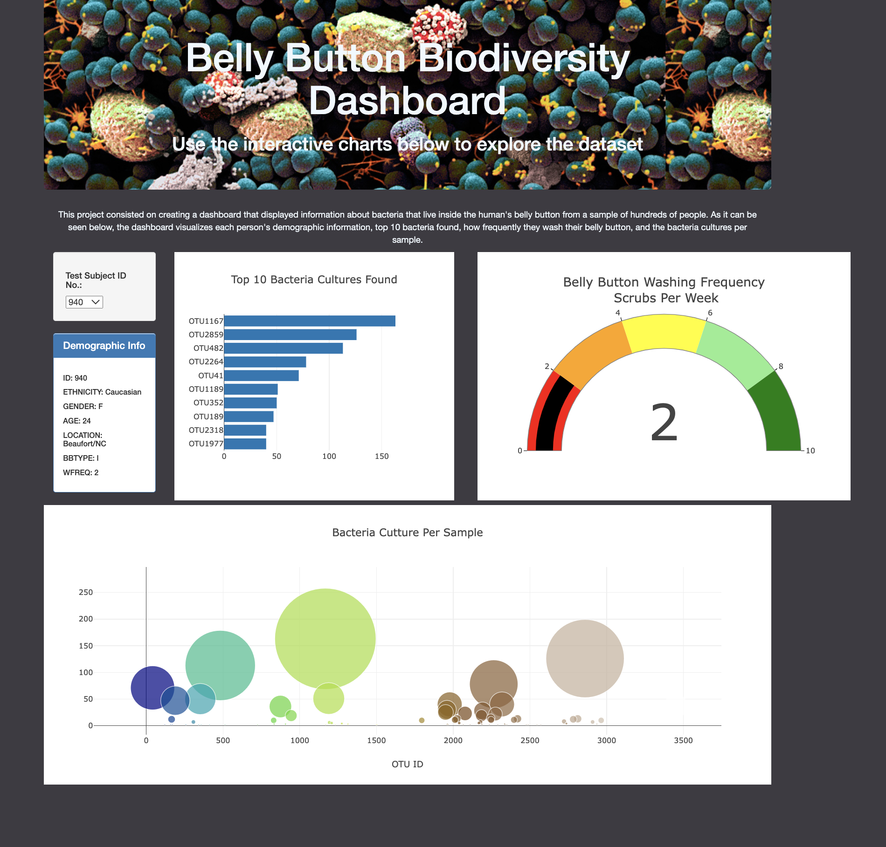

# Belly-Button
---
---


*What can not be found in the human body. And now we are engaged in the study of bacteria located in our belly-button in order to synthesize protein.*

## Project Overview
---
**In this project, we have created a web application that tells us about the bacteria living in the human body, namely in the belly-button. Using the example of more than a hundred people from the drop-down menu, our dashboard allows us to visualize the following informafion of each person:**
- [x] demographic information;
- [x] top 10 bacteria found;
- [x] how frequently they wash their belly button;
- [x] bacteria cultures per sample.
## Resourses
___

+ Data
  + [samples.json](./samples.json)
  
+ Software
  + Javascript
  + Plotly
  + HTML\CSS
  
## Results
____
The final result was interactive [dashboard](https://dangcoop.github.io/Belly-Button/) presented in a convinient way to the end users through GitHub Pages.


```C++
Denis Antonov 09/02/2022
```